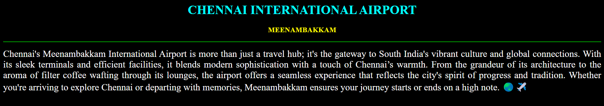
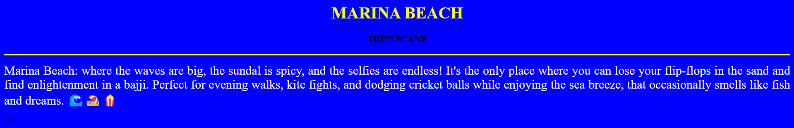
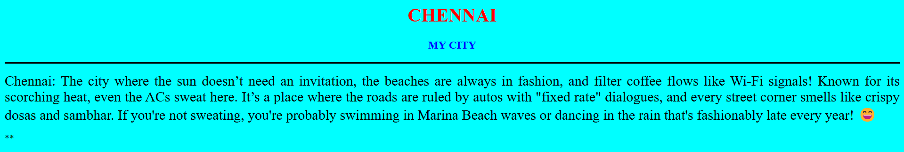
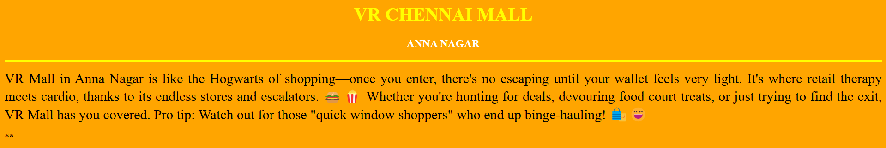
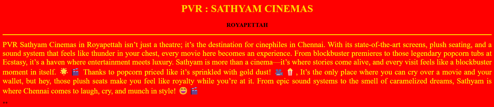
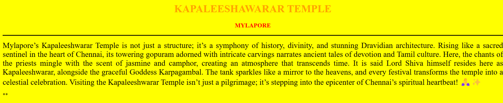

# Ex04 Places Around Me
## Date: 09 / 12 / 2024

## AIM
To develop a website to display details about the places around my house.

## DESIGN STEPS

### STEP 1
Create a Django admin interface.

### STEP 2
Download your city map from Google.

### STEP 3
Using ```<map>``` tag name the map.

### STEP 4
Create clickable regions in the image using ```<area>``` tag.

### STEP 5
Write HTML programs for all the regions identified.

### STEP 6
Execute the programs and publish them.

## CODE

```
MAP.html

<html>
   <head>
    <title>MY CITY</title>
   </head>
   <body>
    <h1 align="center">
        <font color="red"><b>CHENNAI - MY CITY</b></font>
    </h1>
    <h3 align="center">
        <font color="blue"><b>VISWAJITH LALITHRAM [ 24000985 ]</b></font>
    </h3>
    <center>
    
    <map name="MyCity">
        <area shape="rect" coords="748,361,821,421" href="city.html" title="CHENNAI">
        <area shape="circle" coords="620,150,45" href="airport.html" title="AIRPORT INTERNATIONAL AIRPORT">
        <area shape="circle" coords="850,300,80" href="beach.html" title="MARINA BEACH">
        <area shape="circle" coords="850,350,150" href="movie.html" title="PVR : SATHYAM CINEMAS">
        <area shape="circle" coords="820,360,170" href="temple.html" title="KAPALEESHWARAR TEMPLE">
    </map>
</center>
   </body>
</html>


AIRPORT.html


<html>
    <head>
        <title>AIRPORT</title>
        </head>
        <body bgcolor="black">
        <h1 align="center">
        <font color="cyan"><b>CHENNAI INTERNATIONAL AIRPORT</b></font>
        </h1>
        <h3 align="center">
        <font color="yellow"><b>MEENAMBAKKAM</b></font>
        </h3>
        <hr size="3" color="green">
        <p align="justify">
        <font face="Times New Roman" size="5" color="white">

            Chennai's Meenambakkam International Airport is more than just a travel hub; it's the gateway to South India's vibrant culture and global connections.
            With its sleek terminals and efficient facilities, it blends modern sophistication with a touch of Chennai’s warmth.
            From the grandeur of its architecture to the aroma of filter coffee wafting through its lounges, the airport offers a seamless experience that reflects the city's spirit of progress and tradition.
            Whether you're arriving to explore Chennai or departing with memories, Meenambakkam ensures your journey starts or ends on a high note. 🌏✈️

        </font>
        </p>**
    </body>
</html>


BEACH.html


<html>
    <head>
        <title>BEACH</title>
        </head>
        <body bgcolor="blue">
        <h1 align="center">
        <font color="yellow"><b>MARINA BEACH</b></font>
        </h1>
        <h3 align="center">
        <font color="black"><b>TRIPLICANE</b></font>
        </h3>
        <hr size="3" color="yellow">
        <p align="justify">
        <font face="Times New Roman" size="5" color="white">

            Marina Beach: where the waves are big, the sundal is spicy, and the selfies are endless!
            It's the only place where you can lose your flip-flops in the sand and find enlightenment in a bajji. 
            Perfect for evening walks, kite fights, and dodging cricket balls while enjoying the sea breeze,
            that occasionally smells like fish and dreams. 🌊🏖️🍿

        </font>
        </p>**
    </body>
</html>


CITY.html


<html>
    <head>
        <title>MYCITY</title>
        </head>
        <body bgcolor="cyan">
        <h1 align="center">
        <font color="red"><b>CHENNAI</b></font>
        </h1>
        <h3 align="center">
        <font color="blue"><b>MY CITY</b></font>
        </h3>
        <hr size="3" color="black">
        <p align="justify">
        <font face="Times New Roman" size="5">
            Chennai: The city where the sun doesn’t need an invitation, the beaches are always in fashion,
            and filter coffee flows like Wi-Fi signals! Known for its scorching heat, even the ACs sweat here. 
            It’s a place where the roads are ruled by autos with "fixed rate" dialogues, and every street corner smells like crispy dosas and sambhar.
            If you're not sweating, you're probably swimming in Marina Beach waves or dancing in the rain that's fashionably late every year! 😄
        </font>
        </p>**
    </body>
</html>


MALL.html


<html>
    <head>
        <title>MALL</title>
        </head>
        <body bgcolor="orange">
        <h1 align="center">
        <font color="yellow"><b>VR CHENNAI MALL</b></font>
        </h1>
        <h3 align="center">
        <font color="white"><b>ANNA NAGAR</b></font>
        </h3>
        <hr size="3" color="yellow">
        <p align="justify">
        <font face="Times New Roman" size="5" color="black">

            VR Mall in Anna Nagar is like the Hogwarts of shopping—once you enter, there's no escaping until your wallet feels very light.
             It's where retail therapy meets cardio, thanks to its endless stores and escalators.
            🍔🍿 Whether you're hunting for deals, devouring food court treats, or just trying to find the exit, VR Mall has you covered.
             Pro tip: Watch out for those "quick window shoppers" who end up binge-hauling! 🛍️😄

        </font>
        </p>**
    </body>
</html>


MOVIE.html


<html>
    <head>
        <title>MOVIE</title>
        </head>
        <body bgcolor="red">
        <h1 align="center">
        <font color="gold"><b>PVR : SATHYAM CINEMAS</b></font>
        </h1>
        <h3 align="center">
        <font color="black"><b>ROYAPETTAH</b></font>
        </h3>
        <hr size="3" color="yellow">
        <p align="justify">
        <font face="Times New Roman" size="5" color="yellow">

            PVR Sathyam Cinemas in Royapettah isn’t just a theatre; it’s the destination for cinephiles in Chennai.
            With its state-of-the-art screens, plush seating, and a sound system that feels like thunder in your chest,
            every movie here becomes an experience.

            From blockbuster premieres to those legendary popcorn tubs at Ecstasy, it’s a haven where entertainment meets luxury.
            Sathyam is more than a cinema—it’s where stories come alive, and every visit feels like a blockbuster moment in itself. 🌟🎬

            Thanks to popcorn priced like it’s sprinkled with gold dust! 🎥🍿,
            It’s the only place where you can cry over a movie and your wallet,
            but hey, those plush seats make you feel like royalty while you’re at it.
            From epic sound systems to the smell of caramelized dreams, Sathyam is where Chennai comes to laugh, cry, and munch in style! 😄🎬

        </font>
        </p>**
    </body>
</html>


TEMPLE.html


<html>
    <head>
        <title>TEMPLE</title>
        </head>
        <body bgcolor="yellow">
        <h1 align="center">
        <font color="orange"><b>KAPALEESHAWARAR TEMPLE</b></font>
        </h1>
        <h3 align="center">
        <font color="red"><b>MYLAPORE</b></font>
        </h3>
        <hr size="3" color="black">
        <p align="justify">
        <font face="Times New Roman" size="5">
            Mylapore’s Kapaleeshwarar Temple is not just a structure; it’s a symphony of history, divinity, and stunning Dravidian architecture.
            Rising like a sacred sentinel in the heart of Chennai, its towering gopuram adorned with intricate carvings narrates ancient tales of devotion and Tamil culture.
            Here, the chants of the priests mingle with the scent of jasmine and camphor, creating an atmosphere that transcends time.

            It is said Lord Shiva himself resides here as Kapaleeshwarar, alongside the graceful Goddess Karpagambal.
            The tank sparkles like a mirror to the heavens, and every festival transforms the temple into a celestial celebration.
            Visiting the Kapaleeshwarar Temple isn’t just a pilgrimage; it’s stepping into the epicenter of Chennai’s spiritual heartbeat! 🙏✨
        </font>
        </p>**
    </body>
</html>

```

## OUTPUT









## RESULT
The program for implementing image maps using HTML is executed successfully.
